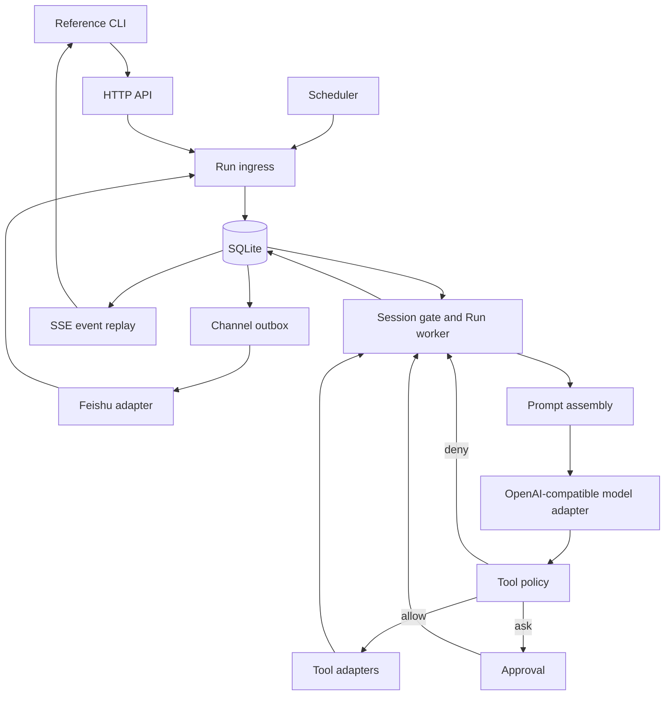

# Personal Agent Kernel Design

**Status:** Approved design
**Date:** 2026-08-07
**Reference baseline:** OpenClaw `2026.7.2`, commit [`aa21c001`](https://github.com/openclaw/openclaw/commit/aa21c001f1311b1712da92637adca306f4964aca)

## 1. Purpose

Build a production-capable personal Agent kernel for one trusted Operator. The project independently reproduces the essential workflow associated with OpenClaw without promising API, configuration, or runtime compatibility.

The kernel must prove this complete chain:

1. An authenticated HTTP request creates a durable Run.
2. Deterministic routing assigns the request to one Personal Agent and Session.
3. Session state is isolated by `(agentId, sessionKey)`.
4. The Agent discovers and activates trusted `SKILL.md` instructions on demand.
5. The model proposes Tool Calls, while deterministic policy decides `allow`, `ask`, or `deny`.
6. An `ask` decision pauses the Run until the Operator approves, denies, or the Approval expires.
7. The Run survives process restarts and resumes from durable state.
8. A primary Agent can create bounded, auditable child Runs for specialist Agents.

The canonical project language is maintained in [CONTEXT.md](../../../CONTEXT.md).

## 2. Product Boundary

### 2.1 Trust model

- One trusted Operator owns and uses the service.
- The service listens on loopback by default and may be explicitly exposed to a trusted private network.
- Every Operator API endpoint except liveness/readiness requires a static Bearer Token. Channel webhooks use adapter-specific signature verification instead.
- Public Internet exposure, mutually untrusted users, and multi-tenancy are outside this design.
- Local SQLite and files rely on operating-system account and file permissions. Application-level data encryption is not included.
- The configured model and Embedding provider is a trusted data processor for the context deliberately sent to it. Secret values are never part of that context.

### 2.2 User surfaces

- The HTTP API is the only behavioral boundary.
- The reference CLI calls the HTTP API and never opens SQLite directly.
- Feishu/Lark private chat becomes the first external Channel in Milestone 3.
- No Web administration console is included.

### 2.3 Delivery milestones

1. **M1: Durable Agent Kernel** - HTTP, CLI, Sessions, Runs, model loop, Skills, Tools, Policy, Approvals, recovery, and Delegation.
2. **M2: Memory and Knowledge Base** - Agent-scoped Memory and cited Markdown/TXT retrieval.
3. **M3: Feishu Channel** - one private-chat Bot bound to one Agent.
4. **M4: Persistent Scheduler** - cron-based creation of ordinary Runs.

Each milestone must pass its own vertical acceptance suite before work begins on the next.

### 2.4 Explicitly deferred

- Drop-in OpenClaw compatibility
- Multi-tenant identity and authorization
- Web UI
- Group-chat routing
- Feishu approval cards
- PDF, Office, and web-crawl ingestion
- MCP, browser automation, and arbitrary plugin marketplaces
- Container or OS sandboxing
- Multi-machine execution and horizontal scaling
- Automatic transcript mining into Memory
- Per-record local/remote model routing

These capabilities receive no speculative empty interfaces. A Port is extracted only when a real adapter is implemented.

## 3. Architecture

The system is a modular monolith running in one Node.js 24 LTS service process. SQLite is the single durable store. The service hosts HTTP, the Run Worker, configuration catalog, optional Channel adapters, and the Scheduler.



### 3.1 Module boundaries

- **Domain:** Session, Run, Run Event, Tool Call, Approval, Delegation, Memory, Knowledge Base, Channel, and Schedule state and invariants.
- **Application:** commands and workflows such as `CreateRun`, `AdvanceRun`, `DecideApproval`, `ReconcileToolCall`, and `FireSchedule`.
- **Ports:** Model, Tool, persistence, Clock, Embedding, retrieval index, and Channel contracts that already have at least one implementation.
- **Adapters:** HTTP, CLI, SQLite, OpenAI-compatible model/Embedding, filesystem, host command, Feishu, and system clock.
- **Configuration catalog:** validates file definitions and creates immutable Agent revisions.

Domain and application code do not import HTTP, SQLite, provider SDKs, or platform-specific Channel code.

### 3.2 Planned source layout

```text
src/
  domain/
  application/
  ports/
  adapters/
    sqlite/
    model/
    tools/
    feishu/
  interfaces/
    http/
    cli/
  modules/
    memory/
    knowledge/
    scheduler/
  config/
  observability/
test/
  unit/
  contract/
  integration/
  e2e/
```

This is one package and one release artifact, not a workspace of independently deployed services.

## 4. Identity and Isolation

### 4.1 Stable identifiers

- `agentId`: lowercase ASCII slug, 1-63 characters.
- `sessionKey`: case-sensitive, URL-safe opaque label, 1-200 characters. Allowed characters are letters, digits, `.`, `_`, `:`, `@`, `/`, and `-`.
- `runId`, `toolCallId`, `approvalId`, and internal `sessionId`: opaque prefixed UUIDv7 values.
- `Idempotency-Key`: caller-generated printable ASCII, 8-128 characters.

### 4.2 Session identity

A Session is uniquely identified by `(agentId, sessionKey)`. A Session Key is never globally unique and is not a Run ID, user identity, or Channel identity.

Only one Run can execute for a Session at a time. Later Runs wait in FIFO order. `waiting_approval` and `waiting_reconciliation` retain the execution slot; Runs for other Sessions continue concurrently.

### 4.3 Delegation

`delegate_agent` creates a persistent child Run in a non-reusable synthetic Session:

```text
delegate:<rootRunId>:<toolCallId>
```

The child receives only the explicit task and context in the Tool Call. It cannot read the parent Session. The parent receives the child result as a Tool result.

M1 limits Delegation to one level and at most four child Runs per root Run. Child Agents cannot delegate again. Deleting a root Session also deletes synthetic child Sessions owned by its Runs.

## 5. Durable Run Model

### 5.1 Run states

```text
queued
running
waiting_approval
waiting_reconciliation
completed
failed
cancelled
```

Terminal states are `completed`, `failed`, and `cancelled`; they have no outgoing transitions.

### 5.2 Tool Call states

```text
proposed
allowed
waiting_approval
denied
executing
succeeded
failed
unknown
```

An Approval is `pending`, `approved`, `denied`, or `expired`. One Tool Call has at most one Approval. Approval only authorizes the exact RFC 8785-canonicalized argument document whose SHA-256 digest is stored with the Tool Call.

### 5.3 Worker leases and recovery

- A Worker transaction claims the oldest eligible queued Run only when the Session has no blocking Run.
- Claims use renewable, time-bounded database leases rather than in-memory locks.
- State changes and their corresponding Run Events commit in one SQLite transaction.
- A crash before a side-effecting Tool starts is safely recoverable after lease expiry.
- A crash after a side effect may have occurred but before its result commits changes the Tool Call to `unknown` and the Run to `waiting_reconciliation`.
- The system never automatically retries an `unknown` side effect.
- The Operator resolves it as `succeeded`, `failed`, or `retry`, with an optional note and synthetic result for the first two outcomes. A retry creates a linked new Tool Call and never rewrites the original record.
- Read-only Tools may be retried after lease loss because their adapter contract forbids external mutation.

### 5.4 Approval and cancellation

- Approval expires after 24 hours by default.
- Expiry is recorded as a denial and returned to the model as a structured Tool result.
- The Operator may cancel any non-terminal Run.
- Cancellation aborts model requests and attempts to terminate a host process tree.
- Already completed side effects are not rolled back.
- If cancellation cannot establish whether a side effect happened, the Tool Call becomes `unknown`.

### 5.5 Default Run limits

All limits are configurable per Agent revision; these defaults apply when omitted:

- 20 model turns
- 12 Tool Calls
- 4 child Runs and delegation depth 1
- 15 minutes of active execution time, excluding Approval and reconciliation waits
- 2 minutes default Tool timeout, capped at 10 minutes
- 1 MiB captured output per Tool Call
- 8 MiB aggregate captured Tool output per Run
- one Tool Call per model turn

Exceeding a hard limit fails the Run with a typed budget error and a durable event.

## 6. SQLite Persistence

SQLite runs with WAL, foreign keys, a non-zero busy timeout, explicit forward migrations, and transactional repository methods. JSON payloads are allowed for event and adapter detail, but fields participating in queries or invariants are relational columns.

### 6.1 Core tables

- `agent_revisions`: resolved Agent, Prompt, Skill catalog, Policy, limits, model, Workspace, and content hashes.
- `sessions`: unique `(agent_id, session_key)`, lifecycle metadata, and current Summary reference.
- `messages`: canonical completed conversation messages with a Session-local sequence.
- `session_summaries`: derived summaries with source-message bounds and model metadata.
- `runs`: state, Session FIFO sequence, parent Run, active-time budget, lease, idempotency request digest, and Agent revision.
- `run_events`: unique `(run_id, sequence)`, event type, timestamp, and redacted payload.
- `tool_calls`: immutable proposal, canonical arguments, digest, Policy decision, execution state, and result.
- `approvals`: unique Tool Call decision, expiry, and resolution metadata.
- `reconciliations`: Operator decisions for `unknown` Tool Calls and links to explicit retry calls.
- `idempotency_keys`: scoped request key, request digest, and original Run.
- `outbox_deliveries`: durable outbound Channel messages and retry state.

### 6.2 Extension tables

- `memories`
- `kb_collections`, `kb_collection_agents`, `kb_sources`, and `kb_chunks`
- `channel_events`
- `schedules` and `schedule_occurrences`

### 6.3 Invariants

- `(agent_id, session_key)` is unique.
- `(run_id, event_sequence)` is unique and gap-free within committed events.
- `(agent_id, session_key, idempotency_key)` is unique.
- A repeated idempotency key with the same request digest returns the original Run.
- A repeated key with a different request digest returns HTTP 409.
- A Tool Call's arguments and digest are immutable after proposal.
- A Session has at most one blocking Run.
- Channel event IDs and Schedule occurrence keys are unique within their adapters.

### 6.4 Deletion and backup

Deleting a Session cascades through messages, summaries, Runs, Run Events, Tool Calls, Approvals, reconciliations, and synthetic child Sessions. It does not delete Memory or Knowledge Base records.

Data is retained until explicit deletion. `myagent backup` uses SQLite's consistent online-backup mechanism and copies versioned Agent files; it never copies a live database file byte-for-byte.

## 7. Run Creation and Model Loop

### 7.1 Ingress normalization

HTTP, Feishu, and Schedule adapters all issue the same `CreateRun` application command:

```ts
type CreateRun = {
  agentId: string;
  sessionKey: string;
  input: { type: "text"; text: string };
  idempotencyKey: string;
  source: { kind: "http" | "feishu" | "schedule"; externalId?: string };
};
```

Creation validates the Agent and input, resolves or creates the Session, stores the effective Agent revision, assigns the Session FIFO sequence, and appends `run.queued` in one transaction.

### 7.2 Prompt trust layers

The model request is assembled in this order:

1. Immutable runtime safety and Tool protocol instructions.
2. The Agent's `AGENT.md`.
3. Bodies of Skills activated during this Run.
4. Session Summary and recent canonical messages.
5. Agent Memory and Knowledge Base excerpts with explicit source delimiters.
6. Current Operator input and Tool results.

Layers 1-3 are trusted instructions. Layers 4-6 are data and cannot override instructions. Retrieved documents and Tool output are explicitly delimited as untrusted content.

### 7.3 Long Sessions

Canonical messages and Run Events are never rewritten for context management. When the context budget threshold is reached, the runtime creates a replaceable Session Summary with source-message bounds. The Summary is prompt compression, not Memory. Original messages remain queryable until the Session is deleted.

### 7.4 Model adapter

The Port supports streaming text, structured Tool Calls, usage, finish reason, and cancellation. M1 provides one OpenAI-compatible Chat Completions adapter because it has the broadest compatible tool-calling surface.

- Transient provider failures retry at most three attempts with bounded exponential backoff and `Retry-After` support.
- Each attempt has an ID. Coalesced `message.delta` events reference that attempt.
- An incomplete failed attempt is followed by `model.attempt.failed`; clients discard its partial text.
- Only `message.completed` becomes a canonical Session message.
- The adapter requests one Tool Call per turn. Multiple returned calls are rejected as a typed model-protocol error and consume a model turn if corrected.
- Provider input can include Agent instructions, Session context, selected Skills, Memory, Knowledge excerpts, and Tool results, but never resolved Secret values.

## 8. Agent and Skill Configuration

### 8.1 File layout

```text
myagent.yaml
agents/
  primary/
    agent.yaml
    AGENT.md
    policy.yaml
  researcher/
    agent.yaml
    AGENT.md
    policy.yaml
skills/
  research/
    SKILL.md
```

Global configuration defines server binding, database path, Agent roots, explicit Skill roots, model providers, and optional adapter configuration. Secret fields contain environment-variable references, never values.

### 8.2 Agent definition

```yaml
id: primary
displayName: Primary Agent
prompt: ./AGENT.md
model: default
workspace: D:/AgentWorkspaces/primary
skills:
  - research
policy: ./policy.yaml
delegates:
  - researcher
knowledgeCollections:
  - personal-docs
context:
  memory: optional
  knowledge: required
limits:
  modelTurns: 20
  toolCalls: 12
  activeExecutionSeconds: 900
```

Different Agents may reference the same Workspace only through explicit configuration.

### 8.3 Validation and reload

- Invalid global configuration prevents service startup.
- An invalid Agent, Prompt, Policy, referenced Skill, or duplicate Agent ID marks only that Agent unavailable.
- Existing Runs recover from their stored revision even if source files change or disappear.
- `POST /v1/config/reload` and `myagent config reload` validate a complete new catalog and atomically publish it for future Runs.
- Global listener and database changes require a process restart.
- V1 does not use implicit filesystem watching.

### 8.4 Skill format and activation

Every `SKILL.md` begins with strict YAML frontmatter:

```yaml
---
name: research
description: Research a question using cited local sources.
version: 1
requiredTools:
  - read_file
---
```

Rules:

- Skill files are discovered only under explicit roots.
- Canonical path and symlink checks prevent escape from a Skill root.
- Each Agent has an explicit Skill allowlist.
- `name`, `description`, and positive integer `version` are required and unique by name.
- `requiredTools` documents dependencies but grants no permission.
- Run creation snapshots catalog metadata and full bodies by content hash.
- The initial model prompt includes only eligible names and descriptions.
- The internal `activate_skill` Tool loads the snapshotted body into the trusted instruction layer for the next turn.
- `activate_skill` is allowed only for Skills in that Run's Agent revision.

## 9. Tool Contracts and Policy

### 9.1 Built-in M1 Tools

- `activate_skill({ skillName })`: internal, read-only, restricted to the revision catalog.
- `list_files({ path, glob?, maxEntries? })`: read-only and Workspace-bound.
- `read_file({ path, startLine?, endLine?, maxBytes? })`: read-only and Workspace-bound.
- `write_file({ path, content, expectedSha256 })`: atomic write; `expectedSha256` is required for replacement and `null` means create-only.
- `run_command({ program, args, cwd?, env?, timeoutMs? })`: side-effecting host process with `shell: false`.
- `delegate_agent({ targetAgentId, task, context })`: side-effecting creation of a bounded child Run.

M2 adds `memory_write` as a side-effecting Tool whose default decision is `ask`.

### 9.2 Argument safety

- Every Tool has a strict schema that rejects unknown fields.
- File paths are canonicalized against the Agent Workspace.
- Existing targets and parents are checked for symlink escape.
- File reads and writes enforce byte limits.
- `write_file` writes a sibling temporary file and atomically replaces after hash validation.
- `run_command` passes a program and argument array directly to the process API. Pipes, redirects, command substitution, and shell expressions are not supported.
- Command working directory remains within the Workspace.
- Environment names are allowlisted. Secret references resolve only inside the Tool adapter after Approval.
- Host command execution is not an OS sandbox. The Approval view must state this plainly.

### 9.3 Policy evaluation

Policy uses ordered, first-match rules. A rule matches Agent, Tool, and typed argument constraints and returns `allow`, `ask`, or `deny`. No match means `deny`.

```yaml
version: 1
rules:
  - tool: activate_skill
    effect: allow
  - tool: list_files
    when: { pathWithinWorkspace: true }
    effect: allow
  - tool: read_file
    when: { pathWithinWorkspace: true }
    effect: allow
  - tool: write_file
    when: { pathWithinWorkspace: true }
    effect: ask
  - tool: run_command
    effect: ask
  - tool: delegate_agent
    when: { targetAgentInDelegates: true }
    effect: allow
  - tool: "*"
    effect: deny
```

Evaluation sequence:

1. Validate Tool schema.
2. Normalize arguments and compute their digest.
3. Evaluate the snapshotted Policy.
4. Persist proposal and decision.
5. Execute immediately for `allow`, create Approval for `ask`, or return structured denial for `deny`.

The model cannot change Policy, resolve Secrets, approve calls, or edit pending arguments.

## 10. HTTP and SSE Contract

### 10.1 Authentication

- `/healthz` and `/readyz` expose only boolean liveness/readiness and require no authentication.
- Every `/v1/*` endpoint requires `Authorization: Bearer <token>`.
- Channel webhook endpoints live outside `/v1`, require their platform signature and identity checks, and never accept a Bearer Token as a substitute.
- The token is read from a Secret reference and compared in constant time.
- Binding beyond loopback requires explicit configuration and emits a startup security warning.

### 10.2 M1 endpoints

| Method | Path | Purpose |
|---|---|---|
| `GET` | `/healthz` | Process liveness |
| `GET` | `/readyz` | Valid configuration and writable SQLite |
| `GET` | `/v1/agents` | Available and unavailable Agent summaries |
| `POST` | `/v1/config/reload` | Atomically reload Agent/Skill/Policy catalog |
| `POST` | `/v1/runs` | Idempotently create a Run |
| `GET` | `/v1/runs/:runId` | Current Run state and terminal result |
| `GET` | `/v1/runs/:runId/events` | Replay and tail SSE events |
| `POST` | `/v1/runs/:runId/cancel` | Request cancellation |
| `GET` | `/v1/approvals?status=pending` | List pending Approvals |
| `POST` | `/v1/approvals/:approvalId/decision` | Approve or deny one exact Tool Call |
| `POST` | `/v1/tool-calls/:toolCallId/reconciliation` | Resolve an `unknown` Tool Call |
| `GET` | `/v1/sessions` | Query Sessions by Agent and Session Key |
| `DELETE` | `/v1/sessions/:sessionId` | Cascade-delete core Session data |

`POST /v1/runs` requires `Idempotency-Key`:

```json
{
  "agentId": "primary",
  "sessionKey": "cli:main",
  "input": { "type": "text", "text": "Summarize the current workspace." }
}
```

It returns HTTP 202:

```json
{
  "runId": "run_...",
  "status": "queued",
  "eventsUrl": "/v1/runs/run_.../events"
}
```

### 10.3 SSE events

Each persisted event has a monotonic Run-local sequence. Reconnect uses `Last-Event-ID` and resumes from the next sequence. A 15-second comment heartbeat keeps intermediaries alive but is not persisted.

```text
id: 42
event: approval.required
data: {"runId":"run_...","sequence":42,"occurredAt":"...","payload":{"approvalId":"apr_...","toolCallId":"call_..."}}
```

Event families include:

- `run.queued`, `run.started`, `run.waiting`, `run.completed`, `run.failed`, `run.cancelled`
- `model.attempt.started`, `message.delta`, `model.attempt.failed`, `message.completed`
- `skill.activated`
- `tool.proposed`, `tool.policy_decided`, `tool.started`, `tool.completed`, `tool.failed`, `tool.unknown`
- `approval.required`, `approval.resolved`
- `delegation.started`, `delegation.completed`
- `context.degraded`

Text deltas are coalesced before persistence and flushed when either 100 ms has elapsed or 1 KiB has accumulated, whichever happens first. SSE never exposes uncommitted provider output.

### 10.4 Errors and idempotent decisions

Errors use `application/problem+json` with a stable machine `code`, human `detail`, and `traceId`. Responses never contain stack traces or Secret values.

Repeating the same Approval decision returns its current representation. Attempting the opposite decision after resolution returns 409. Reconciliation `retry` is idempotent and returns the linked retry Tool Call.

Approval request:

```json
{ "decision": "approve" }
```

Reconciliation request:

```json
{
  "outcome": "succeeded",
  "note": "The file exists with the expected checksum.",
  "result": { "path": "reports/today.md", "sha256": "..." }
}
```

`result` is treated as Operator-supplied Tool data, is size-limited and redacted, and is returned to the model on resume. It is forbidden for `retry`; retry creates a new linked Tool Call from the original immutable arguments.

## 11. CLI

The CLI obtains the API base URL and Bearer Token from environment or explicit Secret references. It supports:

```text
myagent serve
myagent config validate
myagent config reload
myagent agents list
myagent run create --agent <id> --session <key> --text <text>
myagent run watch <runId>
myagent run cancel <runId>
myagent approvals list
myagent approvals approve <approvalId>
myagent approvals deny <approvalId>
myagent tools reconcile <toolCallId> --as succeeded|failed|retry
myagent sessions list
myagent sessions delete <sessionId>
myagent backup <destination>
```

M2-M4 add Memory, Knowledge Base, Feishu diagnostics, and Schedule commands without bypassing the corresponding HTTP resources.

## 12. Milestone 2: Memory and Knowledge Base

### 12.1 Separate ownership

- **Knowledge Base:** Operator-managed source documents organized into Collections. Collections may be attached to multiple Agents.
- **Memory:** versioned fact, preference, or observation owned by one Agent and derived from interaction.
- Session Summary is neither Knowledge Base nor Memory.

### 12.2 Knowledge ingestion

- M2 accepts local UTF-8 Markdown and TXT files only.
- A Source is identified by Collection and canonical file path.
- SHA-256 content identity prevents duplicate re-indexing.
- Deterministic default chunking uses approximately 800 model tokens with 120-token overlap and preserves file and position metadata.
- Retrieval combines SQLite FTS5 and vector similarity through reciprocal-rank fusion.
- The initial Embedding adapter uses the configured OpenAI-compatible provider and the same trusted-provider boundary as model calls.
- Default retrieval returns at most six merged chunks within the Agent context budget.
- Every excerpt includes Collection, source path, and chunk/position metadata so final answers can cite it.

The vector index is behind a Port because it has a real M2 implementation. SQLite remains authoritative for source/chunk metadata and index version.

### 12.3 Retrieval failure behavior

Agent configuration marks Memory and Knowledge context as `required` or `optional`.

- `optional` failure emits `context.degraded` and the Run continues without that source.
- `required` failure fails the Run before model generation to avoid silently ungrounded output.

### 12.4 Memory writes

- The model proposes `memory_write({ kind, content, sourceMessageIds })`.
- Policy defaults it to `ask`.
- Approved Memory is versioned and linked to its source Run and Approval.
- The Operator can list, search, edit, supersede, and delete Memory through HTTP/CLI.
- Deleted or superseded Memory is excluded from retrieval but retained in its audit history until explicitly purged with the Agent's Memory data.
- No automatic post-conversation extraction runs in M2.

### 12.5 M2 acceptance

- A cited answer resolves to the correct source file and position.
- Re-indexing unchanged content creates no duplicate chunks.
- Updating a file replaces obsolete chunks atomically by index version.
- Unapproved Memory never appears in a later prompt.
- Agent A cannot retrieve Agent B's Memory.

## 13. Milestone 3: Feishu Channel

One Bot configuration binds to one Agent and one allowed Operator `open_id`.

The inbound endpoint is `POST /channels/feishu/events`. It is exempt from Bearer authentication only because the adapter validates the Feishu signature, timestamp window, event identity, and allowlisted `open_id` before creating any Run.

Inbound flow:

1. Validate platform signature and timestamp window.
2. Reject group chats and non-allowlisted identities.
3. Deduplicate the platform event ID in SQLite.
4. Map the DM to `sessionKey = feishu:dm:<openId>`.
5. Create a Run using the platform event ID as the idempotency key.
6. Return the webhook acknowledgement without waiting for the Run.

Outbound flow uses `outbox_deliveries` and bounded exponential retry. It sends progress state changes, Approval references, and final output. Long text is split according to platform limits. An outbound failure never re-executes the Run.

Approval messages contain the Approval ID and safe Tool summary, but M3 does not accept authorization from Feishu.

M3 acceptance requires duplicate webhook delivery to produce exactly one Run and one logical final response.

## 14. Milestone 4: Scheduler

A Schedule stores:

- cron expression
- IANA timezone
- `agentId`
- `sessionKey`
- prompt text
- enabled state
- `nextFireAt` in UTC

The Scheduler atomically leases due rows, creates a unique occurrence key, advances `nextFireAt`, and submits an ordinary `CreateRun`. Duplicate claims return the original Run through the occurrence key.

After downtime, all missed occurrences for a Schedule are coalesced into at most one immediate compensating Run, then normal cron timing resumes. A scheduled Run obeys Session FIFO, budgets, Policy, Approval, and reconciliation exactly like an HTTP Run.

## 15. Failure Semantics

- Invalid global configuration: fail startup before the business listener opens.
- Invalid individual Agent: mark unavailable; other Agents continue.
- SQLite unavailable or busy beyond timeout: readiness false, API 503, Worker backoff, no uncommitted side effect.
- Model transient error: retry within attempt and Run budgets.
- Optional context unavailable: emit degradation and continue.
- Required context unavailable: fail before model generation.
- Tool schema/Policy denial: return a structured denial to the model.
- Tool definite failure: return the typed failure; the model may adapt within budget.
- Tool ambiguous side effect: block for reconciliation and never auto-retry.
- Feishu delivery failure: retry outbox only; never retry the Run.
- Schedule duplicate: return original occurrence Run.

## 16. Observability

- Run Events are the Operator-facing canonical audit trail.
- Structured JSON logs include `traceId`, `runId`, `sessionId`, `toolCallId`, and adapter operation IDs.
- A centralized redactor covers Secret references, configured sensitive keys, authorization headers, model payloads, Tool arguments, and errors.
- `/healthz` reports process liveness only.
- `/readyz` reports a boolean readiness result for configuration and writable SQLite without revealing paths or credentials.
- Product telemetry is disabled and no remote analytics are sent.

## 17. Testing Strategy

### 17.1 Pure unit and property tests

- Run and Tool Call transition tables
- terminal-state immutability
- one blocking Run per Session
- FIFO eligibility
- Policy first-match/default-deny behavior
- Approval argument-digest immutability
- path normalization and symlink escape rejection
- prompt trust-layer ordering
- cron and timezone calculations
- Run budget accounting

### 17.2 Adapter contract tests

- scripted OpenAI-compatible streaming and Tool Calls
- Tool schema and cancellation contracts
- SQLite migrations and repository transactions
- Embedding and retrieval index contracts
- Feishu signature, deduplication, and output limits

### 17.3 Integration tests

Use a real temporary SQLite database with deterministic Clock, UUID, Model, Embedding, Tool, and Channel fakes. Exercise HTTP, SSE, Worker leases, Approval expiry, restart recovery, config snapshots, and outbox delivery.

### 17.4 Fault-injected end-to-end tests

Terminate the process at every durable boundary:

- before and after Run claim
- before and after model attempt commit
- before Tool execution
- after Tool side effect but before result commit
- while waiting for Approval
- after Approval resolution but before Worker resume
- during SSE and Feishu delivery

Restart and prove that no unapproved Tool executes, no known side effect is duplicated, and ambiguous effects enter reconciliation.

### 17.5 Platform and live-provider checks

- Core automated suites run on Windows and Linux.
- Real provider credentials are never required for the normal suite.
- An opt-in smoke job validates one configured provider without asserting nondeterministic model text.

## 18. Release Gates

For every milestone:

1. Unit, property, contract, integration, and applicable end-to-end suites pass.
2. A database can migrate from empty state and reopen after a forced restart.
3. Logs, events, errors, and test snapshots contain no Secret values.
4. Duplicate ingress produces one Run.
5. Approved acceptance scenarios pass using real adapters for that milestone.

M1 additionally requires the full chain: HTTP → Session isolation → Skill activation → allowed Tool → Approval pause → restart → Approval → Tool completion → final response, plus one child Agent Run.

## 19. Decision Records

The concise rationale for hard-to-reverse choices is stored in [docs/adr](../../adr/):

- Single-Operator trust and local data boundary: ADR 0001
- Independent semantic reimplementation: ADR 0002
- TypeScript/Node.js: ADR 0003
- Durable recoverable state: ADR 0004
- Persistent Run resources and SSE: ADR 0005
- Agent-scoped Sessions: ADR 0006
- Deterministic routing and Delegation: ADR 0007
- On-demand instruction-only Skills: ADR 0008
- Session serialization: ADR 0009
- Knowledge Base and Memory separation: ADR 0010
- Schedules create ordinary Runs: ADR 0011
- Default-deny Tool Policy: ADR 0012
- Controlled host commands without an OS sandbox: ADR 0013
- File-defined Agents and explicit Workspaces: ADR 0014
- Trusted model-provider data boundary: ADR 0015
- No automatic retry for ambiguous side effects: ADR 0016
- Canonical history with derived Session Summaries: ADR 0017
- Per-Run configuration snapshots: ADR 0018
- Modular monolith with SQLite: ADR 0019

## 20. Next Step

After the Operator reviews and accepts this written specification, create a separate implementation plan. The plan must preserve the four milestone gates and begin with M1 only; it must not combine Memory, Feishu, or Scheduler work into the first implementation batch.
