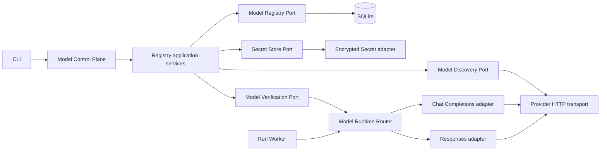
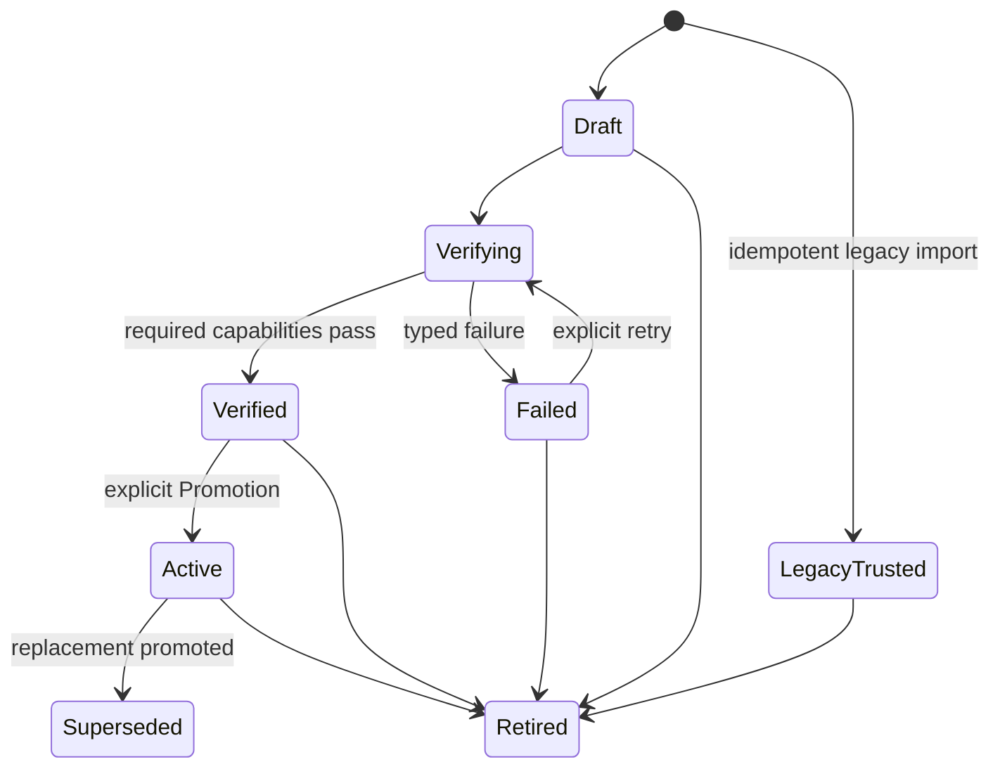

# Multi-Provider Model Registry and Protocol Routing Design

**Status:** Approved written specification
**Date:** 2026-08-09
**Extends:** [Personal Agent Kernel Design](./2026-08-07-personal-agent-kernel-design.md)

## 1. Purpose

Extend the Personal Agent kernel from one file-configured OpenAI-compatible Chat Completions model adapter to an Operator-managed, multi-provider model control plane. The Operator can select a provider preset or a custom OpenAI-compatible endpoint, enter a Base URL and API Key, discover advertised models, verify one selected model, promote it, and assign it to an Agent.

The feature must prove this chain:

1. The Operator creates a Provider Connection through an authenticated loopback management API or CLI.
2. A write-only credential becomes an encrypted, immutable Secret Version.
3. Model Discovery lists provider-advertised model identifiers without treating them as verified.
4. Model Verification proves streaming text and one structured Tool Call through Chat Completions or Responses.
5. The Operator explicitly promotes the verified Model Profile Revision and assigns it to an Agent.
6. A new Run snapshots that exact revision and routes through the fixed Invocation Protocol.
7. Approval, restart recovery, and Tool result continuation preserve the provider Tool Call ID.
8. Failed edits, verification, rotation, or provider health checks never change an active Assignment implicitly.

Canonical terminology is maintained in [CONTEXT.md](../../../CONTEXT.md).

## 2. Product Boundary

### 2.1 Included

- OpenAI, DeepSeek, and custom OpenAI-compatible Provider Connections
- Chat Completions and Responses Invocation Protocols
- Provider presets that supply creation-time suggestions
- Provider Connection and Model Profile versioning
- Encrypted managed API Keys and existing environment Secret references
- Model Discovery through the standard Models API
- Manual model ID entry when discovery is unsupported
- Durable, asynchronous Model Verification
- Explicit Promotion, Default Model Profile, and per-Agent Model Assignment
- Interactive and non-interactive CLI workflows over HTTP
- Idempotent migration from the existing flat YAML model configuration

### 2.2 Deferred

- Web administration UI
- Embedding, Rerank, Knowledge Base, or Memory model binding
- Image, audio, video, or other multimodal inputs
- Anthropic Messages, Gemini GenerateContent, or other native provider protocols
- Azure authentication, OAuth, and arbitrary custom authorization headers
- Provider-managed conversation state and `previous_response_id`
- Raw or summarized reasoning output
- Automatic price comparison, benchmarks, or model recommendations
- Runtime protocol fallback or cross-provider failover
- Remote model administration over the network

The design exposes concrete protocol and persistence ports required by the two implemented protocols. It does not create a dynamic plugin ABI.

## 3. Architecture

The service remains one TypeScript modular monolith backed by SQLite.



### 3.1 Module responsibilities

- **Domain:** Provider Connection, Model Profile, immutable revisions, Verification, Promotion, Assignment, Retirement, Provider Health, and their invariants.
- **Application:** create and revise connections, discover models, create profiles, verify candidate revisions, promote revisions, bind Agents, rotate Secrets, retire resources, and import legacy configuration.
- **Ports:** Model Registry, Secret Store, Model Discovery, Verification Store, Provider Transport, and protocol-specific model execution.
- **Adapters:** SQLite repositories, AES-GCM managed Secrets, OpenAI SDK discovery, Chat Completions, Responses, HTTP routes, and CLI commands.
- **Configuration catalog:** file-defined Agent identity, Prompt, Skills, Policy, Workspace, delegation, and limits. It no longer owns active model configuration.

Domain and application modules do not import Fastify, SQLite, Node crypto, or the OpenAI SDK.

### 3.2 Agent resolution

Agent files no longer contain the active model. At Run creation, an `AgentResolver` combines the current file-defined Agent revision with the exact Model Profile Revision selected by its Model Assignment. The resulting `AgentRevisionSnapshot` contains the complete effective model runtime configuration and is stored with the Run.

Workers recovering an existing Run use only its stored snapshot. They do not query the current Model Registry and cannot observe later Provider Connection, Model Profile, Secret, Promotion, or Assignment changes.

### 3.3 Protocol-first routing

`ModelRuntimeRouter` implements the runtime Model Port and selects an adapter from the Invocation Protocol fixed in the Run snapshot. Provider Kind selects only a compatibility policy containing creation defaults, safe parameter hints, and normalized provider error hints.

OpenAI, DeepSeek, and custom OpenAI-compatible connections share Chat and Responses protocol implementations. A future native provider adds a protocol adapter instead of duplicating registry, Secret, discovery, verification, and error-handling workflows.

## 4. Model Registry

### 4.1 Stable resources and immutable revisions

Stable resources use Operator-selected immutable ASCII slugs and mutable display names. Revisions use opaque system-generated identifiers.

| Resource | Durable responsibility |
|---|---|
| `provider_connections` | Stable identity, display name, Provider Kind, active revision, Retirement state, and record revision |
| `provider_connection_revisions` | Base URL, Provider Auth, Secret Version reference, network policy, protocol preference, Preset version, and lifecycle state |
| `model_profiles` | Stable identity, display name, active revision, Retirement state, and record revision |
| `model_profile_revisions` | Exact Connection Revision, provider model ID, fixed Invocation Protocol, context window, capability baseline, and lifecycle state |
| `model_verifications` | Durable job and result for one exact Profile Revision and capability baseline |
| `model_assignments` | Agent ID, exact Profile Revision, source, and record revision |
| `managed_secret_versions` | Immutable encrypted Secret material and lifecycle metadata |
| `managed_secret_keyring` | Singleton non-secret current Key ID, update timestamp, and optimistic record revision |
| `discovered_models` | Minimal normalized model metadata scoped to one Connection Revision and discovery generation |
| `provider_health` | Latest operational observation without authority to alter configuration |
| `model_registry_events` | Secret-free append-only administrative audit events |

### 4.2 Revision lifecycle



Lifecycle state may change; revision content may not. Changing a Base URL, Provider Auth, Secret reference, provider model ID, Invocation Protocol, context limit, network policy, Preset-effective value, or capability baseline creates a new revision.

### 4.3 Invariants

- A Model Profile Revision references one exact Provider Connection Revision.
- Verification is valid only for one exact Profile Revision and capability baseline version.
- Promotion changes only a stable resource's active revision.
- Model Profile Promotion does not update Agent Assignments.
- Model Assignment references an exact Active or Legacy-Trusted Profile Revision.
- New Assignments require a Verified Active Profile Revision.
- A Default Model Profile points to a stable Profile. A newly registered, unassigned Agent receives one explicit Assignment to that Profile's then-active revision.
- Changing the default or promoting the default Profile never changes existing Assignments.
- Retirement prevents new use but preserves existing Assignments and Run snapshots.
- Purge requires no stable assignment, retained revision, Run snapshot, or Secret reference.
- Provider Health and discovery cache contents never alter verification or assignment authority.

## 5. Static Configuration and Startup

The versioned `myagent.yaml` retains only static boot configuration:

```yaml
version: 2
server:
  host: 127.0.0.1
  port: 8787
  bearerToken:
    fromEnvironment: MYAGENT_BEARER_TOKEN
  adminToken:
    fromEnvironment: MYAGENT_ADMIN_TOKEN
database:
  path: ./data/kernel.db
  busyTimeoutMs: 5000
agentRoots:
  - ./agents
skillRoots:
  - ./skills
toolEnvironmentAllowlist:
  - PATH
modelControl:
  discoveryCacheSeconds: 600
  discoveryTimeoutMs: 10000
  verificationRequestTimeoutMs: 30000
  verificationJobTimeoutMs: 120000
  maxDiscoveredModels: 1000
  maxDiscoveryResponseBytes: 2097152
  verificationConcurrency: 1
```

`MYAGENT_MASTER_KEY` is boot material rather than a Secret stored by MyAgent. It is a Base64-encoded 32-byte key. `MYAGENT_PREVIOUS_MASTER_KEY` may hold the prior key during controlled master-key rotation.

Each configured generation has a non-secret deterministic ID serialized as `mk_` plus the unpadded Base64URL encoding of the full SHA-256 digest of its 32 decoded key bytes. The database never stores key bytes or key fragments. Invalid or missing material is retained as an unavailable generation during initialization so local startup is not blocked; Secret operations map it to `secret_locked`.

Startup order is:

1. Parse and validate static configuration.
2. Resolve the Run and Admin Tokens. A missing Admin Token fails startup.
3. Open SQLite and apply schema migrations.
4. Initialize the Model Registry and Secret Store.
5. Run the idempotent legacy model import when required.
6. Load Agent, Prompt, Skill, and Policy files.
7. Synchronize Agent identities and create eligible default Assignments.
8. Start Run, Approval expiry, and Verification workers.
9. Start HTTP listeners.

A missing or mismatched master key does not prevent startup. Managed Provider Connections that cannot resolve their Secrets become Locked.

`POST /v1/config/reload` reloads only file-defined Agent resources. Provider, Profile, Secret, Verification, Promotion, and Assignment changes take effect through the Model Control Plane without restart.

## 6. Model Control Plane

### 6.1 Authentication and reachability

The Model Control Plane is rooted at `/v1/admin`. It requires the Admin Token and accepts requests only when the actual socket peer is loopback. It does not trust forwarded client-address or scheme headers. The ordinary Run Bearer Token grants no model-management authority.

### 6.2 Concurrency and response safety

Every Operator/control-plane mutation and stable-resource mutation other than stable resource creation supplies `expectedRevision`. A mismatch returns `409 revision_conflict`. Successful audited mutations append a Secret-free audit event and return the new record revision.

This optimistic-concurrency rule governs Operator/control-plane mutations and stable-resource changes. Internal Verification claim, attempt, lease-renewal, and completion transitions instead compare their durable state plus `leaseOwner`; informational Provider Health observations carry no configuration authority and do not emit Registry audit events.

Queueing a Verification is a mutation of the owning Model Profile. Its request therefore supplies that Profile's `expectedRevision`, even though the route identifies the exact immutable Profile Revision being verified.

Master-key rotation supplies the singleton Managed Secret Keyring's `expectedRevision`. The transaction increments that record only after all active Secret Versions have been re-encrypted successfully.

The first successful Secret Version creation initializes an absent Keyring at record revision `0`. Startup never changes the stored Keyring. If configured current material differs from the Keyring, existing rows may resolve through matching previous material, but new Secret creation is `secret_locked` until explicit rotation succeeds. Rotation requires the stored Keyring to match the configured previous generation, re-encrypts to the configured current generation, and then increments the Keyring revision. A missing Keyring cannot be rotated.

Appending an immutable Model Profile Revision is an optimistic mutation of its stable Model Profile. The application/store command requires the Profile's `expectedRevision`, rejects retired Profiles, appends one revision, and emits one audit event without changing the active head.

Credential inputs are write-only. Responses expose only an opaque Secret Version ID and `credentialConfigured`. They never return plaintext, ciphertext, Key fragments, provider response bodies, or request bodies.

### 6.3 Resource routes

The control plane provides these resource-oriented operations:

```text
POST /v1/admin/provider-connections
GET  /v1/admin/provider-connections
GET  /v1/admin/provider-connections/{connectionId}
POST /v1/admin/provider-connections/{connectionId}/revisions
POST /v1/admin/provider-connections/{connectionId}/promotions
POST /v1/admin/provider-connections/{connectionId}/retirement

POST /v1/admin/provider-connection-revisions/{revisionId}/discover
GET  /v1/admin/provider-connection-revisions/{revisionId}/models

POST /v1/admin/model-profiles
GET  /v1/admin/model-profiles
GET  /v1/admin/model-profiles/{profileId}
POST /v1/admin/model-profile-revisions/{revisionId}/verifications
GET  /v1/admin/model-verifications/{verificationId}
POST /v1/admin/model-verifications/{verificationId}/cancel
POST /v1/admin/model-profiles/{profileId}/promotions
POST /v1/admin/model-profiles/{profileId}/retirement

PUT  /v1/admin/agents/{agentId}/model-assignment
GET  /v1/admin/agents/{agentId}/model-assignment
PUT  /v1/admin/default-model-profile
GET  /v1/admin/default-model-profile

POST /v1/admin/provider-connections/{connectionId}/purge
POST /v1/admin/model-profiles/{profileId}/purge
POST /v1/admin/managed-secret-versions/{secretVersionId}/destruction
POST /v1/admin/managed-secrets/master-key-rotation
```

Connection or Profile purge and Managed Secret destruction are separate explicit operations. Retirement never implies Secret destruction.
Master-key rotation returns only the number of re-encrypted versions, the non-secret current Key ID, and the new Keyring `recordRevision`.

### 6.4 Setup transaction sequence

The interactive setup flow is:

1. Select OpenAI, DeepSeek, or Custom.
2. Enter stable slug, display name, Base URL, Provider Auth, and optional API Key.
3. Persist a new Secret Version and Connection draft revision.
4. Discover models synchronously or choose manual model entry when discovery is unsupported.
5. Select a model and confirm the context limit.
6. Create and asynchronously verify a fixed-protocol Profile draft revision.
7. Review resolved protocol, capabilities, Usage, and any warnings.
8. Explicitly promote the Connection Revision and Profile Revision.
9. Optionally make the Profile the default and bind selected Agents.

No step before explicit Promotion changes an active connection, profile, default, or assignment.

## 7. Provider Presets and Connections

### 7.1 Presets

OpenAI and DeepSeek Presets provide a display name, suggested Base URL, required Bearer auth, protocol preference, and known-safe request defaults. Custom defaults to OpenAI-compatible semantics and may explicitly select Bearer auth or no auth.

Preset changes in a software release affect only new connections or an explicit Operator action to apply suggestions. Every Connection Revision stores its complete effective values and Preset version, so an upgrade cannot silently change a credential destination or protocol.

### 7.2 Base URL semantics

Preset URLs are complete API prefixes. A custom Base URL is preserved except for removal of trailing slashes. MyAgent does not guess or append `/v1` and does not probe alternate prefixes.

URLs must use HTTP or HTTPS and may not contain user information, query parameters, or fragments.

### 7.3 Provider Auth

Initial auth modes are:

- `bearer`: one environment or Managed Secret reference
- `none`: an explicit unauthenticated connection, primarily for local models

OpenAI and DeepSeek Presets require `bearer`. Arbitrary static headers, Azure keys, and OAuth are deferred behind a future Provider Auth adapter boundary.

The Provider HTTP Transport, not SDK defaults, owns authorization. In `none` mode it suppresses the OpenAI SDK Authorization header entirely rather than sending a synthetic credential.

## 8. Model Discovery

Discovery calls the standard Models API through the configured Base URL and Provider Auth. It follows provider pagination up to 1,000 entries and stores only normalized ID, optional owner and creation metadata, discovery generation, `fetchedAt`, and `expiresAt`. Raw provider payloads are neither persisted nor logged.

The default cache lifetime is 10 minutes. A normal list may return timestamped stale data. An explicit refresh attempts a live request; if it fails, the response distinguishes the refresh error from any stale cached result.

Discovery states are:

- `fresh`: a live result inside its cache lifetime
- `stale`: a prior result outside its cache lifetime
- `empty`: the endpoint succeeded but advertised no models
- `unsupported`: the endpoint clearly does not exist
- `failed`: authentication, transport, limit, or protocol failure

Only `empty` and `unsupported` permit the manual model ID path automatically. An Operator may retry other failures but cannot convert an authentication or transport failure into a successful discovery result.

A discovered ID is not a Model Profile and is not assignable. Discovery does not infer text generation, Tool support, context size, pricing, or model family.

## 9. Model Verification

### 9.1 Durable operation

Verification is a persistent resource with `queued`, `running`, `passed`, `failed`, and `cancelled` states. The HTTP create returns `202` and an operation URL. A SQLite lease allows a Verification worker to recover work after restart.

The worker performs at most two attempts for a transient request failure and honors `Retry-After`. Authentication, validation, unsupported protocol, and missing capability errors do not retry.

### 9.2 Capability baseline

The initial baseline requires:

1. A bounded streaming request that emits public text and completes.
2. A bounded request forced to produce exactly one synthetic `capability_probe` Tool Call with valid JSON arguments.

The synthetic Tool is never registered with Tool Policy, persisted as a Run Tool Call, approved, or executed. Usage is recorded when supplied but is not required for verification.

The Verification Record stores only the exact Profile Revision ID, capability baseline version, normalized capabilities, stable result code, safe HTTP status, Usage, timestamps, and trace ID.

### 9.3 Automatic protocol choice

OpenAI and DeepSeek prefer Responses. Custom connections prefer Chat Completions unless the Operator overrides the preference.

An automatic verification begins with a new fixed-protocol draft revision. Only `404`, `405`, `501`, or a validated `unsupported_endpoint` provider code permits the application to create and verify a second draft revision using the fallback protocol. Authentication failures, rate limits, timeouts, network errors, and model refusals do not trigger protocol fallback.

Each candidate remains immutable and receives its own Verification Record. A passing candidate is eligible for explicit Promotion; a failed candidate remains inspectable and has no authority.

### 9.4 Verification validity

Verification does not expire by time. It becomes stale when its Connection Revision, Secret reference, model ID, Invocation Protocol, context configuration, or capability baseline changes. Runtime provider failures update Provider Health but do not revoke Verification.

The context window is not load-tested. A known Preset may suggest a maintained value. An unknown model defaults to an explicit, visible assumption of 32,768 input tokens, which the Operator may override.

## 10. Promotion, Assignment, and Retirement

A Provider Connection Revision is eligible for Promotion after either successful discovery or a passing Model Verification against a Profile Revision that references it. A Model Profile Revision is eligible only with a current passing Verification for the exact revision and capability baseline. Promoting a Profile whose Connection Revision is not active is rejected; the control-plane workflow must promote the Connection first.

Promotion atomically updates the corresponding stable resource head, marks the previous head Superseded, and emits an audit event. It does not update Agent Assignments or any dependent Profile Revision.

An Agent Assignment references one exact Profile Revision. Creating or replacing it requires a Verified Active Revision and `expectedRevision`. The assignment affects only Runs created after commit.

When an Agent first appears without an Assignment, the Registry assigns the then-active revision of the Verified Default Model Profile. Changing the default or promoting that Profile does not rebind existing Agents.

An Agent remains visible when unassigned or unusable. Run creation fails with a typed reason instead of selecting a model implicitly:

- `422 model_assignment_required` for no Assignment
- `422 verification_required` for an ineligible revision
- `503 model_provider_locked` for an unresolved Managed Secret

Retirement forbids new Promotion or Assignment but does not break an existing Assignment or Run. Purge is allowed only when no retained object references the target. Secret destruction requires a separate confirmation after reference checks.

## 11. Runtime Model Contract

### 11.1 Snapshot

The effective model portion of `AgentRevisionSnapshot` contains:

```text
providerConnectionRevisionId
providerKind
baseUrl
providerAuth SecretRef
modelId
invocationProtocol
maxInputTokens
verifiedCapabilities
compatibilityPresetVersion
```

Resolved Secret values are never included.

### 11.2 Protocol-neutral input

```ts
type ModelInput =
  | {
      type: "message";
      role: "system" | "user" | "assistant";
      name?: string;
      content: string;
    }
  | {
      type: "assistant_tool_call";
      callId: string;
      name: string;
      arguments: JsonValue;
    }
  | {
      type: "tool_result";
      callId: string;
      name: string;
      output: JsonValue;
    };
```

The provider Tool Call ID is stored with the durable Tool Call. Chat Completions uses it as `tool_call_id`; Responses uses it as `function_call_output.call_id`. Approval pause, restart, and resume therefore reconstruct valid provider context.

### 11.3 Protocol-neutral output

```ts
type ModelChunk =
  | { type: "text_delta"; text: string }
  | {
      type: "tool_call";
      callId: string;
      name: string;
      arguments: JsonValue;
    }
  | {
      type: "completed";
      finishReason:
        | "completed"
        | "tool_call"
        | "length"
        | "content_filter"
        | "unknown";
      usage?: ModelUsage;
    };
```

One Tool Call per model turn remains the kernel invariant. Both protocol adapters request no parallel Tool Calls and reject a provider response containing multiple calls.

### 11.4 Chat Completions

The existing adapter is retained behind the router and updated to:

- map structured assistant Tool Calls and Tool results with durable call IDs
- treat Usage as optional
- normalize finish reasons
- use the shared Provider HTTP Transport
- keep SDK retries disabled

### 11.5 Responses

The Responses adapter:

- uses `store: false`
- never supplies `previous_response_id`
- maps only public output text, function calls, Usage, and terminal status
- ignores and never persists raw reasoning items
- reconstructs all Session context from local canonical messages and Tool records
- uses the same cancellation, Tool Call count, retry, redaction, and error rules as Chat Completions

The runtime never falls back to another protocol. A protocol failure makes the current model attempt fail explicitly and updates Provider Health.

## 12. Secret Store

### 12.1 Managed Secret encryption

Managed Secrets use AES-256-GCM from Node crypto. Each Secret Version receives a cryptographically random nonce. Secret identity, version, and purpose are authenticated as additional data. SQLite stores ciphertext, nonce, authentication tag, non-sensitive Key ID, timestamps, and lifecycle state.

Plaintext is accepted only by a write-only control-plane request, held for the shortest practical time, registered with the dynamic Redactor, encrypted, and omitted from errors and audit events.

### 12.2 Secret references

The runtime Secret resolver supports:

- existing `{ fromEnvironment: NAME }` references
- opaque Managed Secret Version references

Environment references imported from legacy configuration retain their externally mutable behavior. They may be copied into a Managed Secret explicitly, but migration does not resolve and persist their values automatically.

### 12.3 API Key rotation

Changing a provider API Key creates a new Secret Version and Connection draft revision. The old Secret Version remains while referenced. Failed discovery or verification leaves the active revision and old Secret unchanged.

### 12.4 Master-key rotation

Master-key rotation uses current and previous keys identified by non-secret Key IDs:

1. Configure the new key as current and the old key as previous.
2. Restart so both generations can be decrypted and new writes use the new key.
3. Invoke an authenticated transactional re-encryption operation.
4. Verify that no old Key ID remains.
5. Remove the previous key and restart.

A database backup contains encrypted Secret rows and Key IDs but no master key. Restore requires the matching key generation.

## 13. Provider Network Policy

All discovery, verification, and runtime calls use one injected Provider HTTP Transport.

- HTTPS is permitted by default.
- HTTP loopback is permitted automatically.
- RFC1918 private-network HTTP requires `allowInsecureHttp` on the Connection Revision.
- Public HTTP, link-local, cloud metadata, multicast, and unspecified targets are denied.
- Host resolution is checked for every request and the validated address is pinned for the connection to prevent DNS rebinding.
- URL credentials, query strings, and fragments are rejected.
- Redirects are limited to the same origin. Authorization is never forwarded across origins.
- TLS certificate verification cannot be disabled.
- Connect, request, total Verification, response size, and discovery item limits are enforced outside the SDK.

The transport uses an injected fetch or dispatcher supported by the OpenAI SDK, so the SDK cannot bypass address, redirect, timeout, or size policy.

## 14. Errors, Health, and Observability

Provider and runtime failures use the following closed set of stable typed codes:

```text
invalid_provider_url
insecure_provider_url
provider_auth_failed
provider_unavailable
provider_rate_limited
model_discovery_unsupported
model_not_found
invocation_protocol_unsupported
streaming_unsupported
tool_call_unsupported
model_protocol_error
secret_locked
verification_required
model_assignment_required
revision_conflict
model_provider_locked
```

Control-plane resource and lifecycle failures use separately typed codes required by the resource operations, including `legacy_assignment_forbidden`, `resource_in_use`, `connection_revision_not_active`, and `legacy_import_already_completed`; they are not provider-error normalization outputs.

Provider errors retain only a normalized code, safe HTTP status, transient flag, bounded `Retry-After`, trace ID, and timestamp. Raw bodies, headers, stack traces, request payloads, Secrets, and reasoning never enter logs, HTTP Problems, Run Events, Verification Records, or audit events.

Provider Health records the latest success or typed failure for a Connection Revision or Profile Revision. It is informational and never changes Verification, Promotion, Retirement, or Assignment state.

The service may be ready while a Provider Connection is Locked or unhealthy. `/readyz` continues to reflect the local service, SQLite, migrations, and worker infrastructure. Resource views and Run creation expose the narrower provider or Agent availability reason.

## 15. CLI

The reference CLI calls only the Model Control Plane and supports interactive and automation workflows:

```text
myagent model setup
myagent providers add|update|list|discover|promote|retire
myagent models create|verify|promote|list|retire
myagent models set-default
myagent agents set-model
myagent verifications get
myagent secrets rotate-master-key
```

Every command has non-interactive flags, `--json`, stable exit codes, and trace IDs for failures. Interactive setup displays connection destination, auth mode, selected model, resolved protocol, capability result, context-window source, and affected Agents before the final Promotion and Assignment confirmation.

The CLI never opens SQLite, decrypts Managed Secrets, or edits YAML directly.

## 16. Legacy Migration

Before the first upgraded startup, the Operator must add the separate Admin Token Secret reference and value. A missing Admin Token fails with a typed, Secret-free configuration error before migration; MyAgent never falls back to the Run Token.

The first startup against legacy configuration performs an idempotent import:

1. Each `models.<alias>` becomes one Provider Connection and one Model Profile. Sharing is not inferred.
2. Provider Kind, Base URL, environment Secret reference, model ID, max input tokens, and Chat Completions protocol are preserved.
3. Each Agent `model: <alias>` becomes one exact Assignment.
4. Imported assigned revisions are marked Legacy-Trusted.
5. Migration version, source hash, alias mapping, and generated IDs are stored transactionally.

A Legacy-Trusted revision may serve only the Assignments created by that import. It cannot become the default, receive a new Assignment, be copied, or be promoted. Formal Verification creates a normal verified candidate; the Operator then promotes and rebinds explicitly.

Legacy YAML model fields are accepted for one deprecation version solely to seed an empty Registry. Once the migration marker exists, file changes cannot overwrite the Registry. Version 2 configuration rejects `models:` and Agent `model:` fields.

## 17. Testing

### 17.1 Unit and property tests

- revision lifecycle and immutable content
- Promotion, Assignment, Default Profile, Retirement, and purge reference rules
- Legacy-Trusted restrictions
- URL and resolved-address network policy across IPv4 and IPv6
- error normalization and retry classification
- ModelInput and ModelChunk protocol-neutral mapping

### 17.2 Secret contract tests

- AES-GCM round trip and authenticated metadata
- random nonce uniqueness
- tampered ciphertext, tag, and associated data rejection
- wrong or missing master key behavior
- immutable Secret versions and reference retention
- two-key master rotation and restart at every step
- encrypted backup restore
- whole-system plaintext leakage scans

### 17.3 Provider contract tests

Deterministic local fake providers cover both protocols:

- text streaming and cancellation
- one structured Tool Call and durable call ID continuation
- missing or partial Usage
- multiple Tool Calls and malformed arguments
- Responses failed and incomplete event sequences
- Chat finish-reason normalization
- 401, 404, 405, 429, 500, timeout, and `Retry-After`
- Models API pagination, cache, unsupported endpoint, and response limits
- same-origin and cross-origin redirects

### 17.4 Integration and end-to-end tests

- optimistic concurrency and audit events
- persistent Verification leases and restart recovery
- failed Connection or Profile revisions leaving active state unchanged
- separate Admin and Run Token authorization
- loopback-only control-plane access
- write-only credential responses
- default and explicit Agent Assignment behavior
- migration idempotency and Legacy-Trusted continuity
- two Agents using separate Chat and Responses Profiles
- Approval pause, restart, Tool completion, and final response through Responses

### 17.5 Live provider smoke test

An opt-in test uses environment variables to discover and invoke a configured DeepSeek `deepseek-v4-flash` Responses model. It verifies protocol completion, Usage when available, no real Tool execution, and Secret containment without asserting nondeterministic text.

Real credentials are never required by the normal suite or committed CI configuration.

## 18. Release Gates

1. Lint, typecheck, build, and all deterministic unit, property, contract, integration, and end-to-end tests pass on Windows and Linux.
2. A clean database migrates, reopens, and recovers interrupted Verification work.
3. Existing YAML fixtures migrate idempotently and existing Assignments continue only as Legacy-Trusted.
4. DeepSeek Responses and custom Chat Profiles can be assigned to different Agents without Session, Skill, Tool, or result leakage.
5. A Responses Tool Call preserves its provider call ID across Approval pause and process restart.
6. Failed verification, API Key rotation, master-key mismatch, and Provider outage do not modify active Assignments.
7. Database, backups, logs, HTTP, SSE, Verification Records, audit events, and snapshots contain no plaintext Managed Secret or raw reasoning.
8. The CLI completes provider creation, discovery, model selection, verification, Promotion, and Agent Assignment through HTTP only.

## 19. Decision Records

- Dynamic SQLite Model Registry and per-Agent Assignment: [ADR 0020](../../adr/0020-manage-model-configuration-in-a-versioned-sqlite-registry.md)
- Protocol-first routing with fixed per-revision protocols: [ADR 0021](../../adr/0021-route-models-by-invocation-protocol.md)
- Encrypted Managed Secrets with external master keys: [ADR 0022](../../adr/0022-encrypt-managed-provider-secrets-with-an-external-master-key.md)
